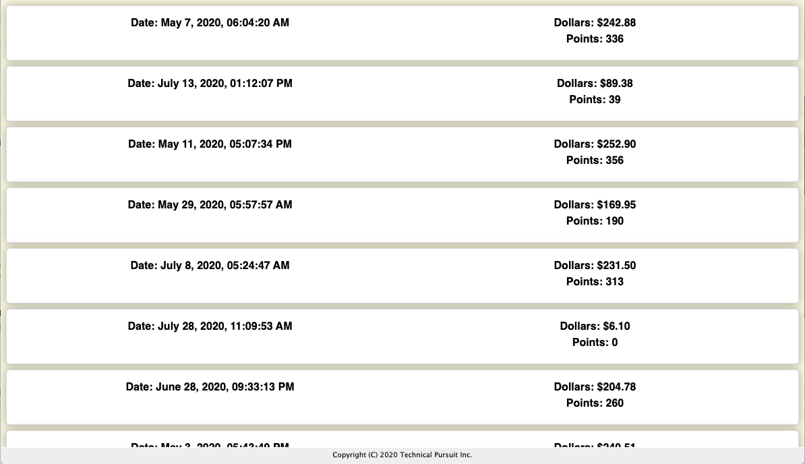

# KForce Exercise

## overview

`Kforce-WJE` is an example for building applications with [React](https://reactjs.org).

The foundation of this template is based on `create-react-app`, a React project framing utility developed by Facebook. Using `create-react-app` provides the minimum requirements for a modern React-based application. _See the [create-react-app readme](REACT-README.md) for more info_.

A number of additional [tools](#tools) have been added to the baseline provided by `create-react-app` to provide a fully-featured template for best-practice development.

Running this template application renders a prototype "dashboard". The dashboard code shows a series of 'cards' that implement the requested exercise. Each card contains a transaction that details the transaction date, dollars spent and the number of points computed for that transaction.

## operation

Once you've installed the [prerequisites](#prereqs) and performed the remaining [installation steps](#installation) you should be able to run `npm run` to see a list of operations you can perform on the project.

``` bash
npm run

Lifecycle scripts included in Kforce-WJE:
  start
    npm run build:css && react-scripts start

available via `npm run-script`:
  build
    react-scripts build
  build:css
    node-sass-chokidar src/ -o src/
  lint
    eslint --ext=js --ext=jsx .
  storybook
    npm run build:css && start-storybook -p 9009 -s public
  stylelint
    stylelint '**/*.scss'

```

### run storybook (optional)

You don't need to run storybook to run the application, but it's a good thing to explore to get a feeling for the various components and how they look.

The `src/stories/index.js` file contains stories which serve as usage examples for each of the main components and can be a useful form of documentation for your own components.

To start storybook and browse the baseline components:

```
npm run storybook
```

Once the storybook service starts open `http://localhost:9009` in Chrome.

### start the application server

To run the application (once the mock server is running) use:

```
npm start
```

Once the react application starts it should open `http://localhost:3000` in your
browser and you should see a display similar to:



### Root Component

The application initially launches from code in `src/index.js` which provides
the attachment between React and the DOM. As shown below `index.js` defines a
`Root` component which renders on the `root` element ID in the native DOM and
which sets up a history object and the top-level route for the `App` component.

```
import React from 'react';
import ReactDOM from 'react-dom';
import { Router, Route } from 'react-router-dom';
import { Provider } from 'react-redux';

import history from './history';
import App from './App';

import './index.css';

const Root = () => (
    <Router history={history}>
        <Route path="*" component={App} />
    </Router>
);

ReactDOM.render(<Root />, document.getElementById('root'));
```

### App Component

As used in this prototype the `App` component rendered by the `Root` component
defines the main routes for the application.

For this prototype we set up a Dashboard route (`/ui`) and a Desktop route
(`/pdt`) and we automatically redirect `/` to the Dashboard route as shown
in the code below. All remaining rendering is handled by the Dashboard and
Desktop components and their subcomponents.


```
import React, { Component } from 'react';
import { Route, Switch, Redirect } from 'react-router-dom';

import Dashboard from './pages/Dashboard/Dashboard';


import './App.css';

class App extends Component {
    render() {
        return (
            <div className="App">
                <Switch>
                    <Route path="/ui" component={Dashboard} />
                    <Redirect exact from="/" to="/ui" />
                </Switch>
            </div>
        );
    }
}

export default App;
```


### Dashboard.js

The Dashboard page is rendered from code in `src/pages/Dashboard/Dashboard.js`.

The major blocks are a header, content, and footer section. The content section
uses a layout component with individual card components holding the various
widgets shown on the page.

For the prototype these widgets demonstrate different ways of using props,
state, and redux-driven data to render.

```
<div className="Dashboard">
    <DashboardContent>
        <DashboardLayout>
            <KForceTest />
        </DashboardLayout>
    </DashboardContent>
    <Footer />
</div>
```

## components

### 'function' components

There are a number of examples of function components (components which do not use the `class` and `extends` keywords) including:

- DashboardContent
- DashboardLayout
- TransactionCard

### 'simple' components

Several relatively simple components use the `class` and `extends` approach to defining a component with a `render` method including:

- CustomerTransaction
- Footer
- Hello
- KForceTest

<a href="#" name="prereqs"></a>
## prereqs

This project requires the following prerequisites to operate properly:

- `git` version `2` or higher.
- `Node.js` version `8.x` or higher.

For non-Windows platforms we strongly recommend using `nvm` (Node Version Manager) to manage your `Node.js` installation. Using `nvm` allows you to easily adjust your `Node.js` version efficiently.

### git

Git is a version control system available from `https://git-scm.com/downloads`. You'll need version 2+ of `git` for your platform to run this project.

### nvm

If you are developing on a non-Windows platform we recommend installing `nvm`, the Node Version Manager, is from `https://github.com/creationix/nvm`.

### Node.js / npm

If you are using `nvm` we recommend using `nvm install` to install Node.js.

If you aren't running `nvm` install Node.js by following the installation instructions for your platform found at `https://nodejs.org`.

<a href="#" name="installation"></a>
## installation

### git clone

With the various prerequisites in place you can start the final installation process. The first step is to clone the `Kforce-WJE` project from Github.

``` bash
git clone https://github.com/TechnicalPursuit/Kforce-WJE.git
```

### npm install

Once the clone operation completes change directories into the project and run `npm install` to install the project's dependencies.

NOTE: the `npm install` step can take a few minutes depending on network speed etc.

``` bash
cd Kforce-WJE
npm install
```


<a name="tools" href="#"></a>
## tools

As the listing of `npm run` scripts above shows, the baseline application template has been augmented with the following tools:

- sass stylesheet language processing for CSS files
- eslint code linter best-practice configuration files/scripts
- stylelint css/sass linter with best-practice configuration
- storybook ui "style guide" and component documentation integration

### node-sass-chokidar

The `node-sass-chokidar` scripts allow you to compile SASS-formatted files to create your CSS files. The project's `.gitignore` file has been specifically updated to avoid checking in `CSS` files since they are generated. Only the `.scss` files which you author are tracked by `git`.

### eslint

The `eslint` framing has been configured to support all the features of modern JavaScript including advanced ECMA6/7/8 features as compiled via `babel`.

### stylelint

Also included for linting is the `stylelint` tool and associated configuration. This tool helps ensure a common format for all `scss` files.

### storybook

The last tool in the list is `storybook`, a powerful tool for keeping your widget development organized and independent of any particular consuming application. You can find out more about storybook at `https://storybook.js.org/`

Some of the components used in the exercise have storybook stories associated with them to demonstrate how they might be used.

